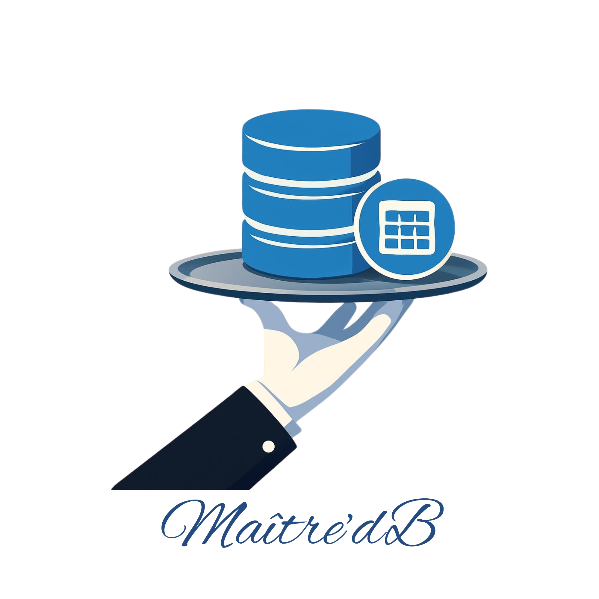

# Maître d'B

<p align="center">
  
</p>

> *The front-of-house manager for your databases.*

A cross-platform, open-source database client with native CLI and GUI — built for humans and agents alike. Handles pooling, query sequencing, credential isolation, governance, and schema introspection as middleware between your applications and your databases.

**Package name**: `maitredb` | **CLI command**: `mdb` | **Org scope**: `@maitredb/*`

## Why Maître d'B?

Most database clients treat the connection as a detail. Maître d'B treats it as a **platform**.

- **No vendor lock-in**: All configuration, credentials, and exports use open formats (JSON, SQL, Parquet, Iceberg). If you uninstall maitredb tomorrow, everything you created still works.
- **Streaming-first**: Query 1 billion rows without exhausting RAM. Results appear instantly; you're not waiting for full buffering.
- **10-50x faster parsing**: Rust-based wire protocol parser and Apache Arrow columnar format instead of row objects.
- **Agent-safe by default**: Query governance policies prevent agents from dropping databases or exfiltrating data. Audit everything.
- **Unified across 11 databases**: One CLI, one API, one error model. SQLite → Snowflake syntax differences handled transparently.
- **Batteries included**: Benchmarking, masking, fake data generation, schema diffing, optimization recommendations, query profiling.

## Features

### Available now (v0.0.1)

- **11 Database drivers registered in CLI/bootstrap**: SQLite, PostgreSQL, MySQL/MariaDB, MongoDB, Snowflake, ClickHouse, DuckDB, BigQuery, Redshift, Athena
- **Secure credential storage**: credentials are stored outside connection config files
- **Constant-memory streaming**: `mdb query --stream` reads in Arrow batches
- **Schema and permissions introspection**: tables/columns/indexes/functions/procedures/types plus roles/grants where supported
- **Local query history**: query metadata is stored in local history DB for auditing
- **MCP stdio server**: read-only query and schema tooling for coding agents

### Planned (not fully shipped yet)

- Rust wire-protocol hot path and full Arrow-native parsing across drivers
- Governance policy engine with approvals, rate limits, and per-connection policy mapping
- Data masking transforms, universal dump/export, benchmarking suite, and GUI

## Installation

maitredb is currently source-first and pre-public preview (not published to npm yet).

```bash
# Clone and install workspace dependencies
pnpm install

# Build CLI and MCP packages
pnpm --filter @maitredb/cli build
pnpm --filter @maitredb/mcp build

# Verify CLI
node apps/cli/dist/cli.js --help
```

### Install as a GitHub Copilot CLI plugin (direct from GitHub)

This repository now includes a `plugin.json` manifest, so you can install it directly from GitHub:

```bash
copilot plugin install sgoley/maitredb
```

The plugin wires in `.github/mcp.json` and starts the Maître d'B MCP server. On first launch it bootstraps dependencies and builds `@maitredb/mcp` automatically.

## Usage Patterns

### 1. CLI from source checkout

Use the built CLI directly from this repository.

```bash
# Build once
pnpm --filter @maitredb/cli build

# Add and verify a local sqlite connection
node apps/cli/dist/cli.js connect add dev --type sqlite --path ./dev.db
node apps/cli/dist/cli.js connect list

# Query and stream
node apps/cli/dist/cli.js query dev "SELECT 1" --format json
node apps/cli/dist/cli.js query dev "SELECT * FROM sqlite_master" --stream --format ndjson

# Introspection and audit history
node apps/cli/dist/cli.js schema dev tables --schema main
node apps/cli/dist/cli.js history --last 10
```

### 2. MCP stdio from source checkout

Build the MCP package and point your MCP client to this local workspace.

```bash
pnpm --filter @maitredb/mcp build
```

Example MCP stdio config (local source checkout):

```json
{
  "mcpServers": {
    "maitredb": {
      "command": "node",
      "args": ["/absolute/path/to/maitredb/packages/mcp/dist/index.js"]
    }
  }
}
```

Available MCP tools:
- `maitredb_list_connections`
- `maitredb_get_schemas`
- `maitredb_get_tables`
- `maitredb_get_columns`
- `maitredb_get_indexes`
- `maitredb_explain` (EXPLAIN only; ANALYZE disabled)
- `maitredb_query` (read-only; mutating and multi-statement SQL blocked)

### 3. Planned integrations (not available yet)

- Docker/TCP MCP deployment examples
- Stable published npm packages for global install and npx
- Higher-level programmatic API examples in root README

## Security & Safety

- Connection credentials are not stored in `connections.json`; they are stored separately via credential backends.
- Local history stores SQL text for auditability; obvious secret literals are redacted before persistence.
- MCP tools are read-only by default: mutating and multi-statement SQL is blocked.
- Agent mode and advanced governance workflows are experimental and should be treated as pre-release behavior.

## What's Complete (v0.0.1)

- ✅ Core CLI command set: `connect`, `query`, `schema`, `permissions`, `history`
- ✅ Connection manager + lazy driver registration across supported dialects
- ✅ Secure credential storage separated from connection metadata
- ✅ Streaming query path and local query history/audit storage
- ✅ MCP stdio server with read-only query and introspection tools

## What's Planned (Future Phases)

From the [Architecture](spec/architecture.md) and [Implementation Plan](spec/implementation-plan.md):

### Phase 2
- Data masking (redaction, hashing, noise injection)
- Query result caching (LRU memory + SQLite disk)
- Agent governance policies (read-only enforcement, operation blocking, audit logs)

### Phase 3
- GUI (Tauri 2 + React) — query editor, schema explorer, results viewer, profiler
- Universal dump (Parquet, Iceberg, CSV export across all databases)
- Fake data generation (schema-aware bootstrapping)

### Phase 4
- Advanced optimization recommendations (missing indexes, query rewrites, performance tuning)
- Benchmarking suite (statistical rigor, regression detection, comparison mode)
- Schema diffing (compare schemas across environments)

### Phase 5
- Query optimization engine (AST rewriting, cost-based suggestions)
- Team/workspace support (shared connection configs, saved query libraries)
- Plugin system (third-party drivers, custom tools)
- Advanced transaction modes (interactive REPL session, multi-statement batches)

## FAQ

### How will my credentials be stored?

Credentials are **never** stored inside `connections.json` or any other plain-text config file that lives alongside your query files. Instead they are handed off to a secure credential backend:

- **macOS / Windows** — the system keychain (`keytar`) is used so credentials are encrypted at rest and protected by your OS login.
- **Linux** — the Secret Service API (GNOME Keyring / KWallet) is used when available, with a fallback to an encrypted local store.
- **CI / headless environments** — credentials can be supplied via `MDB_*` environment variables, which are never written to disk by maitredb.

The connection file only stores non-secret metadata (host, port, database name, driver type). If you share or commit `connections.json`, no secrets are exposed.

---

### How do the guardrails prevent accidental or malicious queries?

Maître d'B applies defence-in-depth across several layers:

1. **Read-only MCP surface** — The MCP stdio server only exposes read and introspection tools. All mutating SQL (`INSERT`, `UPDATE`, `DELETE`, DDL, etc.) and multi-statement batches are rejected at the tool layer before they reach the driver.
2. **Operation blocking** (Phase 2) — The governance policy engine lets you declare per-connection allow/deny lists of SQL operation types (e.g., deny `DROP`, `TRUNCATE`, `GRANT`).
3. **Rate limiting & approvals** (Phase 2) — High-impact queries above a configurable row-count or cost threshold require explicit human approval before execution.
4. **Audit log** — Every query (text, timestamp, connection, row count, execution time) is appended to a local history database. Sensitive literal values are redacted before persistence so secrets that accidentally appear in queries are not stored in cleartext.
5. **Agent mode** (`--as agent`) — Skips interactive auth prompts but enforces the full governance policy set, so automated callers get *less* latitude than interactive users, not more.

No governance layer is a guarantee against all misuse, but the combination of a read-only default surface, an explicit policy engine, and a tamper-evident audit trail makes it significantly harder to cause accidental or intentional damage.

---

### How do I benchmark Maître d'B against a native driver?

The built-in benchmarking suite (Phase 4) will provide statistical, reproducible comparisons. In the meantime:

- Use `mdb query --stream` for large result sets — the Rust wire-protocol parser and Apache Arrow columnar format are designed to match or beat JavaScript driver throughput for read-heavy workloads because the entire result buffer is parsed in a single Rust call rather than one JS object per row.
- For raw connection overhead you can time `mdb query <conn> "SELECT 1"` against equivalent `psql`/`mysql`/`sqlite3` invocations. Expect a small one-time Node.js startup cost that disappears in long-running processes.
- The benchmarking suite (when shipped) will let you run the same query through the maitredb streaming path and a bare driver path, reporting p50/p95/p99 latency, throughput (rows/s and MB/s), and memory ceiling side-by-side with configurable repetitions and warm-up rounds.

If you need to benchmark today, the `packages/core` streaming path is the hot path to profile — it routes wire bytes directly to the Rust parser and yields Arrow `RecordBatch` objects without allocating intermediate row arrays.

---

### Why not just let the agent connect to the database via a native CLI or simpler interface?

Several reasons make a dedicated middleware layer worth the overhead:

| Concern | Native CLI / raw driver | Maître d'B |
|---|---|---|
| **Credential handling** | Credentials often appear in command arguments or env vars that are visible in process listings and shell history | Credentials are resolved from a secure keychain at runtime and never passed as arguments |
| **Blast radius control** | Agent has full database permissions by default | Governance policies restrict allowed operations, row counts, and cost budgets per connection |
| **Audit trail** | No persistent audit log; queries disappear | Every query is logged with metadata for post-incident review |
| **Streaming large results** | `psql` buffers entire result sets; JSON-over-stdio is slow for millions of rows | Arrow batches stream row-by-row with constant memory |
| **Cross-database portability** | Each CLI has its own flags, output formats, and connection strings | One `mdb query` command works across all 11 databases with consistent output formats |
| **Agent safety** | A confused or prompt-injected agent can run arbitrary DDL | Read-only MCP surface and operation blocklists limit the damage a compromised agent can do |

In short, a native CLI gives an agent *full access with no guardrails*. Maître d'B is the layer that adds credential isolation, policy enforcement, and observability without the agent needing to know which database it is talking to.

---

### Does Maître d'B work without an internet connection?

Yes. All operations — querying, introspection, history, credential storage — are fully local. There is no telemetry, no phone-home, and no licence server. Cloud-hosted databases (Snowflake, BigQuery, Redshift, Athena) obviously still require network access to reach their endpoints, but the maitredb tooling itself is entirely offline-capable.

---

### What happens to my data if I uninstall maitredb?

Nothing is lost. The File Over App philosophy means:

- `connections.json` is plain JSON you can read and edit with any text editor.
- Query history is stored in a standard SQLite database you can open with any SQLite client.
- Exported data uses open formats (Parquet, Iceberg, CSV, SQL) that any tool can consume.
- Credentials remain in your OS keychain, accessible via `keytar` or your system's keychain UI.

Uninstalling the `mdb` binary simply removes the tool. Your data, history, and credentials are unaffected.

---

### Which Node.js versions are supported?

Node.js **20 LTS** and **22 LTS**. The Rust native addon (`@maitredb/wire`) ships prebuilt binaries for those versions; a pure-JS fallback is used automatically if the native module cannot load (e.g., unsupported architecture or Node version).

---

## Contributing

Contributions welcome! Please:

1. **Read the spec first**: [Architecture](spec/architecture.md) explains design decisions and the monorepo layout
2. **Check existing issues**: Search for similar work before starting
3. **Follow conventions**: See [CLAUDE.md](CLAUDE.md) for code quality expectations
4. **Test before submitting**: Run `pnpm test` and `pnpm lint` locally

### Build & Test

```bash
# Install dependencies
pnpm install

# Build all packages
pnpm build

# Run tests
pnpm test

# Type-check
pnpm lint

# Watch mode (development)
pnpm dev
```

## Feedback & Issues

- **Bugs**: [Open an issue](https://github.com/maitredb/maitredb/issues) with steps to reproduce
- **Feature requests**: Include your use case and why existing solutions don't fit
- **Questions**: Open a [discussion](https://github.com/maitredb/maitredb/discussions)

## Documentation

- **[Architecture](spec/architecture.md)** — Design decisions, streaming model, driver contract, performance architecture
- **[Implementation Plan](spec/implementation-plan.md)** — Phased delivery roadmap, backlog
- **[Copilot Instructions](.github/copilot-instructions.md)** — For AI assistants working in the repo
- **API Reference** — `pnpm docs:reference` (generates Markdown into `docs/reference/`)

## License

MIT
